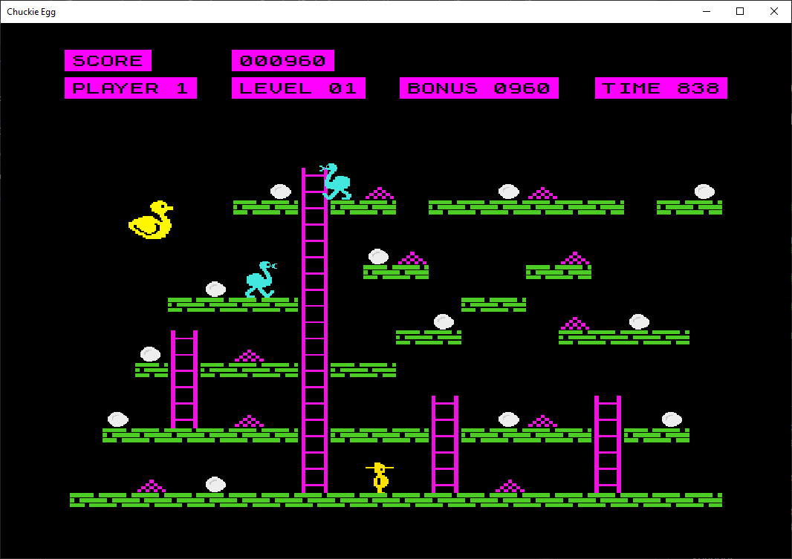

# Zápočtový program: 
# *Chuckie Egg*

## Specifikace

Jedná se o klon klasické plošinovky Chuckie Egg, původně vydané v roce 1983. Hra je napsaná v jazyce C# pomocí WinForms a vizuálně vychází z adaptace pro počítač BBC Micro. 

Hráč ovládá postavičku jménem Harry, který má za úkol v každé úrovni posbírat všech 12 vajíček. To musí zvládnout v časovém limitu a zároveň se vyhýbat pohybujícím se kachnám. Hra obsahuje 8 unikátních map, které se po dokončení opakují s navýšenou obtížností. Celkem tak je ve hře 32 různých úrovní. Jednotlivé úrovně se skládají z pevných plošin a žebříků, případně z pohybujících se plošin.

## Instalace a spuštění

Pro spuštění přejděte do složky `Chuckie-Egg` a spusťte příkaz `dotnet run`.

Před spuštěním se ujistěte, že máte nainstalované .NET SDK verze 8.0 nebo vyšší.

## Dokumentace

* [Uživatelská dokumentace](docs/user.md)
* [Ukázky použití](docs/examples.md)
* [Programátorská dokumentace](docs/programmer.md)
