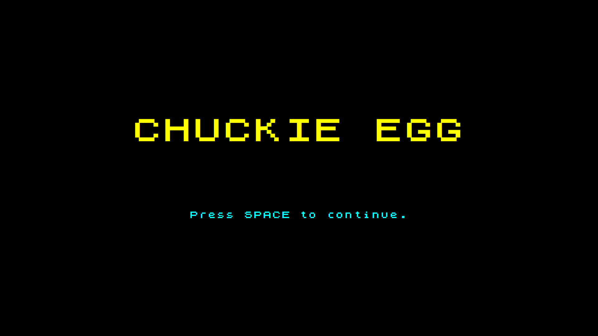
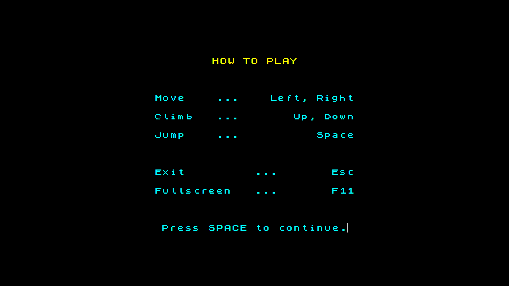
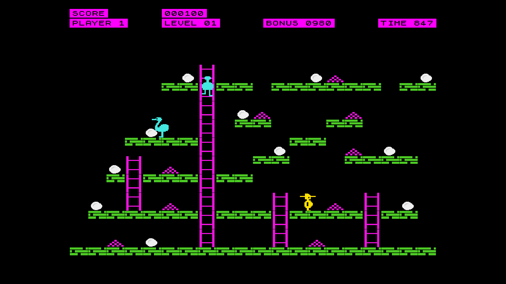

# Uživatelská dokumentace

## Spuštění hry

Pro spuštění přejděte do složky `Chuckie-Egg` a spusťte příkaz `dotnet run`.

Před spuštěním se ujistěte, že máte nainstalované .NET SDK verze 8.0 nebo vyšší.

Ukázka úvodní obrazovky:

*Obrázek 1 – Úvodní obrazovka hry*

Úvodní obrazovky (titulní obrazovka, intro, instrukce) projdete stiskem mezerníku (`SPACE`).

## Ovládání

Ukázka obrazovky s ovládáním:

*Obrázek 2 – Obrazovka s ovládáním*

Ve hře použijte následující klávesy:

- **←** pohyb doleva  
- **→** pohyb doprava  
- **↑** lezení nahoru po žebříku  
- **↓** lezení dolů po žebříku  
- **SPACE** skok

Další ovládání:

- **Esc** – ukončení hry  
- **F11** – přepnutí do/z celoobrazovkového režimu

# Cíl hry

Ukázka obrazovky ze hry:

*Obrázek 3 – Ukázka hry*

V každé úrovni je vaším cílem posbírat všech 12 vajíček a vyhýbat se kachnám. To musíte zvládnout v časovém limitu, který lze dočasně zastavit sběrem kukuřice. V případě, že se hráč střetne s kachnou nebo spadne mimo mapu, přichází o jeden z pěti životů. Životy lze získat zpět za každých 10 000 bodů.

Hra obsahuje celkem 8 různých úrovní. Po jejich dokončení se hra opakuje s rostoucí obtížností.

- **Úrovně 1–8:** pouze malé kachny
- **Úrovně 9–16:** velká kachna pronásleduje hráče
- **Úrovně 17–24:** malé i velká kachna současně
- **Úrovně 25–32:** více malých kachen

Po dokončení těchto 32 úrovní se hra opakuje s nezměněnou obtížností.